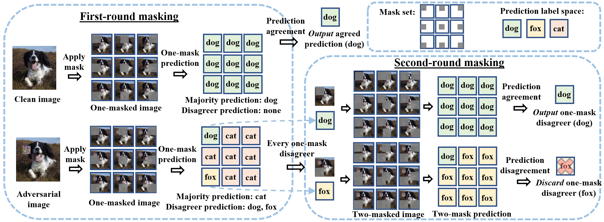

# PatchCleanser:  Certifiably Robust Defense against Adversarial Patches for Any Image Classifier
By [Chong Xiang](http://xiangchong.xyz/), [Saeed Mahloujifar](https://smahloujifar.github.io/), [Prattek Mittal](https://www.princeton.edu/~pmittal/)

Code for "[PatchCleanser:  Certifiably Robust Defense against Adversarial Patches for Any Image Classifier](https://arxiv.org/abs/2108.09135)" in USENIX Security Symposium 2022. 

Update 02/06: make some minor changes to the model loading and update the [pretrained weights](https://drive.google.com/drive/folders/1Ewks-NgJHDlpeAaGInz_jZ6iczcYNDlN?usp=sharing) 

Update 01/2022: Our paper is accepted by USENIX Security Symposium 2022. We will release the camera-ready version soon!



**Takeaways**: 

1. We design a *certifiably robust defense* against adversarial patches that is *compatible with any state-of-the-art image classifier*.
2. We achieve clean accuracy that is comparable to state-of-the-art image classifier and improves certified robust accuracy by a large margin. 
3. We visualize our defense performance for 1000-class ImageNet below! 


#### Check out this [paper list for adversarial patch research](https://github.com/xiangchong1/adv-patch-paper-list) for more fun!

## Requirements
The code is tested with PyTorch 1.7.0 and timm 0.4.12. The complete list of required packages are available in `requirement.txt`, and can be installed with `pip install -r requirement.txt`. The code should be compatible with other versions of packages.

## Files
```shell
├── README.md                        #this file 
├── requirement.txt                  #required package
├── example_cmd.sh                   #example command to run the code
| 
├── pc_certification.py              #PatchCleanser: certify robustness via two-mask correctness 
├── pc_clean_acc.py                  #PatchCleanser: evaluate clean accuracy and per-example inference time
| 
├── vanilla_clean_acc.py             #undefended vanilla models: evaluate clean accuracy and per-example inference time
├── train_model.py                   #train undefended vanilla models for different datasets
| 
├── utils
|   ├── setup.py                     #utils for constructing models and data loaders
|   ├── defense.py                   #utils for PatchCleanser defenses
|   └── cutout.py                    #utils for masked model training
|
├── misc
|   ├── pc_mr.py                     #script for minority report (Figure 9)
|   └── pc_multiple.py               #script for multiple patch shapes and multiple patches (Table 4)
| 
├── data   
|   ├── imagenet                     #data directory for imagenet
|   ├── imagenette                   #data directory for imagenette
|   ├── cifar                        #data directory for cifar-10
|   ├── cifar100                     #data directory for cifar-100
|   ├── flower102                    #data directory for flower102
|   └── svhn                         #data directory for svhn
|
└── checkpoints                      #directory for checkpoints
    ├── README.md                    #details of checkpoints
    └── ...                          #model checkpoints
```
## Datasets
- [ImageNet](http://www.image-net.org/) (ILSVRC2012)
- [ImageNette](https://github.com/fastai/imagenette) ([Full size](https://s3.amazonaws.com/fast-ai-imageclas/imagenette2.tgz))
- [CIFAR-10/CIFAR-100](https://www.cs.toronto.edu/~kriz/cifar.html)
- [Oxford Flower-102](https://www.robots.ox.ac.uk/~vgg/data/flowers/102/)
- [SVHN](http://ufldl.stanford.edu/housenumbers/)

## Usage
- See **Files** for details of each file. 
- Download data in **Datasets** to `data/`.
- (optional) Download checkpoints from Google Drive [link](https://drive.google.com/drive/folders/1Ewks-NgJHDlpeAaGInz_jZ6iczcYNDlN?usp=sharing) and move them to `checkpoints`.
- See `example_cmd.sh` for example commands for running the code.
- See `USENIX-AE/AE-README.md` for instructions to reproduce all results in the main body of paper.

If anything is unclear, please open an issue or contact Chong Xiang (cxiang@princeton.edu).


## Citations

If you find our work useful in your research, please consider citing:

```tex
@article{xiang2021patchcleanser,
  title={PatchCleanser: Certifiably Robust Defense against Adversarial Patches for Any Image Classifier},
  author={Xiang, Chong and Mahloujifar, Saeed and Mittal, Prateek},
  journal={arXiv preprint arXiv:2108.09135},
  year={2021}
}
```


